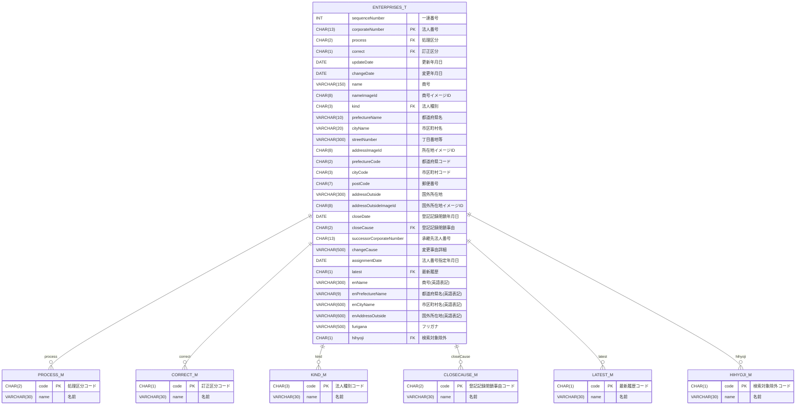

# ER 図 / Entity Relationship Diagram

## 日本企业数据库 ER 图 / Japanese Enterprise Database ER Diagram

基于 `JpComp_ctbl.sql` 生成的实体关系图，展示了企业数据库的表结构和关系。

## 表说明 / Table Descriptions

### 主数据表 (Master Tables) - `_M` 后缀

1. **PROCESS_M** (処理区分マスタ)
   - 企业处理状态的主数据表
   - 包含新规、变更、合并等处理类型

2. **CORRECT_M** (訂正区分マスタ)
   - 记录是否为订正记录的主数据表
   - 区分正常记录和订正记录

3. **KIND_M** (法人種別マスタ)
   - 法人类型的主数据表
   - 包含股份公司、有限公司等企业类型

4. **CLOSECAUSE_M** (登記記録閉鎖事由マスタ)
   - 登记记录关闭原因的主数据表
   - 包含清算结束、合并等关闭原因

5. **LATEST_M** (最新履歴マスタ)
   - 记录是否为最新信息的主数据表
   - 区分历史记录和最新记录

6. **HIHYOJI_M** (検索対象除外マスタ)
   - 搜索对象排除的主数据表
   - 控制记录是否在搜索中显示

